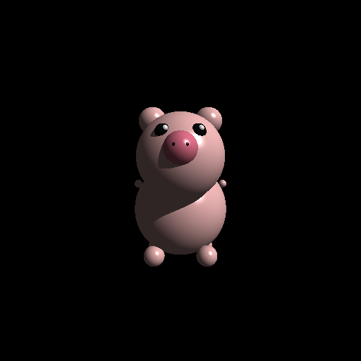

# 🐷 Raytracer - Cerdito 3D

Un raytracer simple implementado en Python que renderiza escenas 3D usando el algoritmo de trazado de rayos. Este proyecto genera una imagen de un cerdito adorable compuesto por esferas.

## 🖼️ Resultado



*Imagen generada por el raytracer mostrando un cerdito 3D compuesto por esferas con iluminación realista*

## 🚀 Características

- **Motor de Raytracing**: Implementación completa del algoritmo de trazado de rayos
- **Figuras geométricas**: Soporte para esferas con intersección precisa
- **Materiales**: Sistema de materiales con componentes difusa, especular y ambiente
- **Iluminación**: 
  - Luz ambiente uniforme
  - Luz direccional con sombras
  - Modelo de sombreado Phong
- **Exportación**: Generación de imágenes en formato BMP
- **Escena personalizada**: Cerdito 3D con anatomía detallada

## 🛠️ Requisitos

- Python 3.7+
- pygame
- numpy

## 📦 Instalación

1. Clona el repositorio:
```bash
git clone https://github.com/skemono/Raytracer.git
cd Raytracer
```

2. Instala las dependencias:
```bash
pip install pygame numpy
```

## ▶️ Uso

Ejecuta el script principal para generar la imagen del cerdito:

```bash
python RayTracer.py
```
