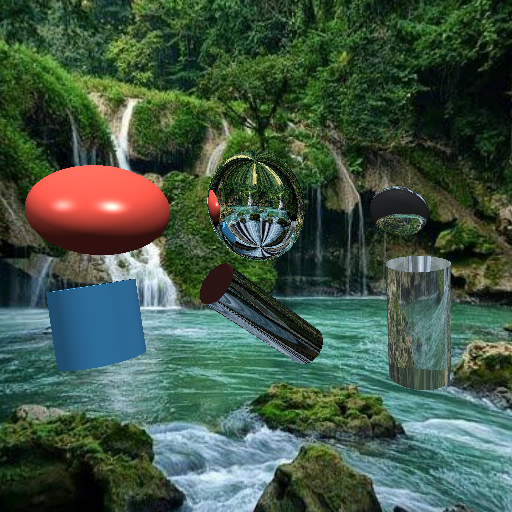

# Raytracer en Python (Trazado de rayos + Materiales + Geometría)

Raytracer educativo en Python que renderiza escenas 3D con materiales opacos, reflectantes, transparentes y refractivos. Incluye figuras extendidas (elipsoide, caja orientada, cilindro con rotación) y escenas de demostración.


## 🚀 Características

- Motor de raytracing con cámara y proyección.
- Geometrías soportadas:
  - Sphere (esfera)
  - Plane (plano infinito)
  - Disk (disco finito)
  - Triangle (Möller–Trumbore)
  - Cube (AABB axis-aligned)
  - Ellipsoid (radii independientes – escalado no uniforme, ahora con rotación Euler)
  - Cylinder (con rotación Euler y tapas)
  - OrientedBox (OBB con rotación Euler)
  - Figura compuesta opcional: ChickenLeg (elipsoide + cápsula) para ejemplo de objetos compuestos
- Materiales (Phong) con:
  - Difuso, especular, ambiente
  - Reflexión (recursiva)
  - Transparencia + refracción básica (IOR + Fresnel)
- Sombreado con sombras por ray casting secundario.
- Escena configurable: fondo con environment map o cuarto cerrado con planos.
- Exportación a BMP.

### Carga de OBJ (mallas)

- Parser de Wavefront OBJ (v, vt, vn, f) con triangulación de n-gons.
- Sombreado plano o suave (si existen normales por vértice en el OBJ).
- Clase `OBJMesh` en `model.py` que implementa intersección rayo-triángulo.
 - UVs de OBJ se interpolan y ahora se pueden usar texturas difusas.

### Texturas PNG/JPG/BMP

- `image_texture.py` permite cargar texturas con Pillow (PNG, JPG/JPEG, BMP, etc.).
- `bmp_texture.py` sigue disponible para BMP sin dependencias.
- Material soporta `diffuseTexture`; se muestrea con UVs.
- Primitivas clave (esfera, cilindro, elipsoide, OBB, etc.) ahora generan UVs procedurales.

Instalación de Pillow:

```powershell
pip install pillow
```

## 🛠️ Requisitos

- Python 3.10+ (probado con 3.13)
- numpy
- pygame

## 📦 Instalación rápida

```powershell
python -m venv .venv; .venv\Scripts\Activate.ps1; pip install -U pip; pip install numpy pygame
```

## ▶️ Uso

Renderizar la escena de demostración (features):

```powershell
.venv\Scripts\python.exe .\RayTracer.py
```

Genera `features_demo.bmp`.

### Escena de laboratorio (Lab8)

Ellipsoids (3) y Cylinders (3) en variantes opaca / reflectiva / transparente, con rotaciones y tamaños distintos.



Render:
```powershell
.venv\Scripts\python.exe .\Lab8Scene.py
```
Salida: `lab8_2.bmp`.

### Renderizar un OBJ con textura

Demo simple para cargar una malla OBJ, agregar luces y renderizar:

```powershell
.venv\Scripts\python.exe .\ObjTexturedDemo.py
```

O bien puedes integrar directamente en tus escenas:

```python
from image_texture import ImageTexture
from model import load_obj
from material import Material

albedo = ImageTexture("./assets/teapot_albedo.png")
mesh_mat = Material(diffuse=[0.8,0.8,0.85], specular=[1,1,1], shininess=96, diffuseTexture=albedo)
mesh = load_obj(
  "./assets/teapot.obj",
  material=mesh_mat,
  position=(0.0, -1.2, -8.0),
  scale=1.0,
  rotation_degrees=(0,180,0),
  smooth_shading=True,
)
rend.scene.append(mesh)
```

### Helper de rotación en grados

Puedes usar la función `deg()` definida en `figures.py` para crear rotaciones Euler sin convertir manualmente:

```python
from figures import Ellipsoid, Cylinder, deg

# Elipsoide rotado 30° en X, 45° en Y, 0° en Z
Ellipsoid(position=[0,1,-8], radii=[1,0.6,1.2], material=mat, rotation=deg(30,45,0))

# Cilindro recostado 90° sobre X
Cylinder(position=[2,-1,-9], radius=0.5, height=2.0, material=mat2, rotation=deg(90,0,0))
```

`deg(a,b,c)` retorna una tupla `(rad(a), rad(b), rad(c))`. Si pasas un solo valor `deg(45)` devuelve `(rad(45),0,0)`.

---

## 🗺️ Escena de la isla con estatua humanoide

La escena `IslandScene.py` construye una isla con cilindros elípticos, prismas y elipsoides. Ahora incluye una estatua humanoide hecha 100% con primitivas (pies, piernas, torso, cabeza y brazos) colocada sobre el aro superior y orientada al Noroeste. La estatua utiliza una textura difusa opcional `statue.png` si está presente.

Vista previa generada:


Ejecutar:

```powershell
.venv\Scripts\python.exe .\IslandScene.py
```

Salida: `island_scene.bmp`.

