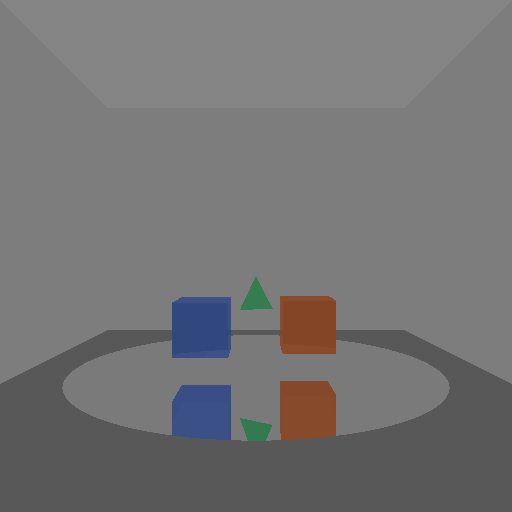

# Raytracer en Python (entregable con environment map + materiales)

Un raytracer simple en Python que renderiza escenas 3D con materiales opacos, reflectantes y transparentes. Ahora también soporta una escena de habitación cerrada (sin environment map) con múltiples tipos de geometría.

## 🖼️ Resultados

### Nueva escena: Habitación con figuras variadas
Habitación minimalista (5 planos) que contiene:
- 2 cubos
- 1 triángulo
- 1 disco reflectante (espejo)




## 🚀 Características

- Motor de raytracing con cámara y proyección.
- Geometrías soportadas:
  - Sphere (esfera)
  - Plane (plano infinito)
  - Disk (disco finito en un plano)
  - Triangle (intersección Möller–Trumbore)
  - Cube (AABB axis-aligned)
- Materiales (Phong) con:
  - Difuso, especular, ambiente
  - Reflexión (recursiva)
  - Transparencia + refracción básica (IOR + Fresnel)
- Sombreado con sombras por ray casting secundario.
- Escena configurable: fondo con environment map o cuarto cerrado con planos.
- Exportación a BMP.

## 🛠️ Requisitos

- Python 3.10+ (probado con 3.13)
- numpy
- pygame

## 📦 Instalación rápida

```powershell
python -m venv .venv; .venv\Scripts\Activate.ps1; pip install -U pip; pip install numpy pygame
```

## ▶️ Uso

Renderizar la escena de la habitación (figuras variadas sobre disco espejo):

```powershell
.venv\Scripts\python.exe .\RayTracer.py
```

Genera `habitacion_figuras.bmp`.

Escena de habitación incluye:
- 5 planos (piso, techo, paredes laterales y fondo)
- 2 cubos pequeños centrados
- 1 triángulo suspendido
- 1 disco grande casi espejo (reflectividad alta)

Nota: Puedes alternar entre usar environment map o un cuarto cerrado según tus pruebas.
