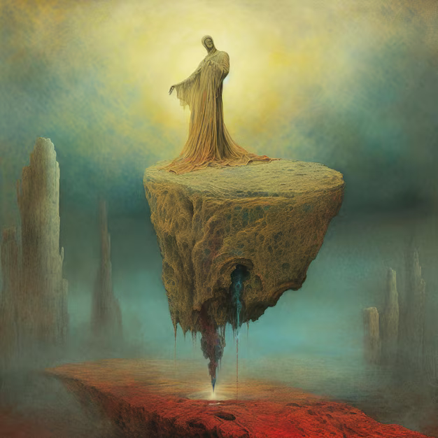
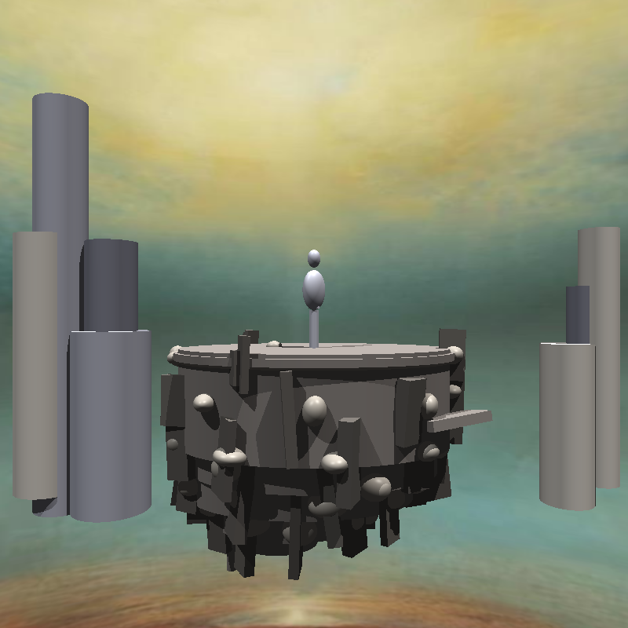

# Escena de la isla — Réplica con primitivas

Este proyecto busca replicar la imagen de referencia `comparativa.png` usando únicamente figuras primitivas dentro de la escena `IslandScene.py`.

La escena incluye:
- Isla hecha con varios cilindros elípticos apilados (borde/terrazas).
- Pilares de fondo para profundidad de campo.
- Plano infinito como suelo, y “rocas” dispersas sobre él usando la misma textura del plano (familia de “pillar”).
- Estatua humanoide encapuchada construida al 100% con primitivas (pies, piernas, botas, rodilleras, torso, cabeza, capucha y capa con pliegues, brazos con articulaciones tipo cápsula, manos/dedos estilizados, hombreras, brazaletes, cinturón y medallón). Orientada al Noroeste y colocada sobre el aro superior de la isla.

## 🖼️ Referencia y resultado

Referencia objetivo:



Resultado renderizado por `IslandScene.py`:



## ▶️ Cómo ejecutar `IslandScene.py`

```powershell
.venv\Scripts\python.exe .\IslandScene.py
```

Esto genera el archivo `island_scene.bmp` en la raíz del proyecto.

### Notas de texturas (opcionales)
- Se intentan cargar `pillar.png`, `rock.png` y `statue.png` si están presentes. Si no existen, los materiales usan colores difusos por defecto.
- El plano infinito y las rocas del suelo emplean la familia de texturas de “pillar” para una lectura visual coherente.

### Parámetros útiles (dentro de `IslandScene.py`)
- Resolución: constantes `WIDTH` y `HEIGHT`.
- Escala y origen de la composición: `S` y `ORG`.
- Densidad de rocas en el plano: función `scatter_ground_rocks(...)`.


