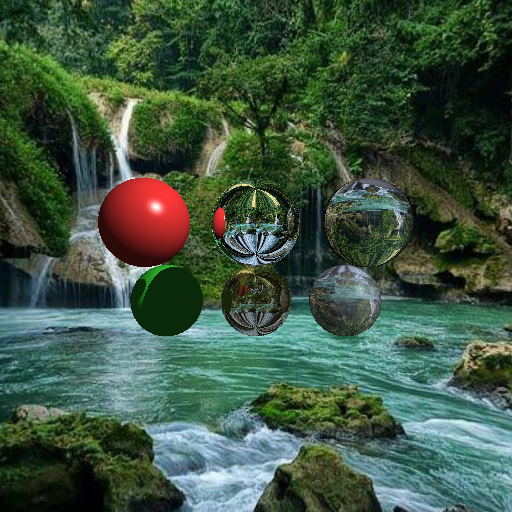

# Raytracer en Python (entregable con environment map + materiales)

Un raytracer simple en Python que renderiza escenas 3D con materiales opacos, reflectantes y transparentes, e incluye un environment map como fondo.

## 🖼️ Resultados

- Escena de 6 esferas con environment map (actual):

  


## 🚀 Características

- Motor de raytracing con cámara y proyección.
- Geometría: esferas con intersección precisa.
- Materiales (Phong) con soporte de:
  - Difuso, especular, ambiente.
  - Reflexión y refracción con Fresnel e índice de refracción (IOR).
- Iluminación:
  - Luz ambiente.
  - Luz direccional con verificación de sombras.
- Environment map (equirectangular) como fondo:
  - Cargado vía `bmp_texture.py`
  - Muestreo bilineal para mejorar calidad y reducir pixelación.
  - Controles de orientación/zoom: `envYaw`, `envPitch`, `envFovScale` en `gl.Renderer`.
- Exportación a BMP.

## 🛠️ Requisitos

- Python 3.10+ (probado con 3.13)
- numpy
- pygame

## 📦 Instalación rápida

```powershell
python -m venv .venv; .venv\Scripts\Activate.ps1; pip install -U pip; pip install numpy pygame
```

## ▶️ Uso

Renderizar la escena principal (6 esferas con environment map):

```powershell
.venv\Scripts\python.exe .\RayTracer.py
```

El resultado se guarda como `semucSpheresEnv.bmp` en la raíz del proyecto.

Actualmente define:

- 2 esferas opacas (rojo, verde)
- 2 reflectantes (espejo, metal pulido)
- 2 transparentes (vidrio, agua)
