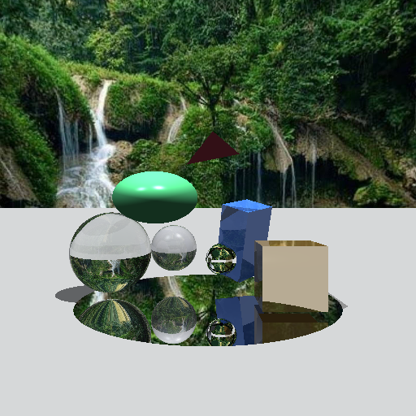

# Raytracer en Python (Tracing + Materiales + Geometría Extendida)

Un raytracer educativo en Python que renderiza escenas 3D con materiales opacos, reflectantes, transparentes y refractivos. Ahora incluye nuevas figuras no simétricas (elipsoide, caja orientada) y una escena de demostración que combina reflexión, refracción y distintas normales.

## 🖼️ Resultados

### Escena de demostración de características
Incluye: esfera vidrio, esfera agua, cubo metálico, caja orientada (OBB), elipsoide escalado, triángulo flotante y disco espejo central.




## 🚀 Características

- Motor de raytracing con cámara y proyección.
- Geometrías soportadas:
  - Sphere (esfera)
  - Plane (plano infinito)
  - Disk (disco finito)
  - Triangle (Möller–Trumbore)
  - Cube (AABB axis-aligned)
  - Ellipsoid (radii independientes – escalado no uniforme)
  - OrientedBox (OBB con rotación Euler)
  - Figura compuesta opcional: ChickenLeg (elipsoide + cápsula) para ejemplo de objetos compuestos
- Materiales (Phong) con:
  - Difuso, especular, ambiente
  - Reflexión (recursiva)
  - Transparencia + refracción básica (IOR + Fresnel)
- Sombreado con sombras por ray casting secundario.
- Escena configurable: fondo con environment map o cuarto cerrado con planos.
- Exportación a BMP.

## 🛠️ Requisitos

- Python 3.10+ (probado con 3.13)
- numpy
- pygame

## 📦 Instalación rápida

```powershell
python -m venv .venv; .venv\Scripts\Activate.ps1; pip install -U pip; pip install numpy pygame
```

## ▶️ Uso

Renderizar la escena de demostración (features):

```powershell
.venv\Scripts\python.exe .\RayTracer.py
```

Genera `features_demo.bmp`.

